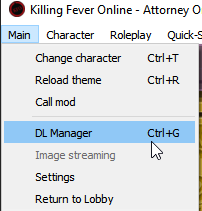
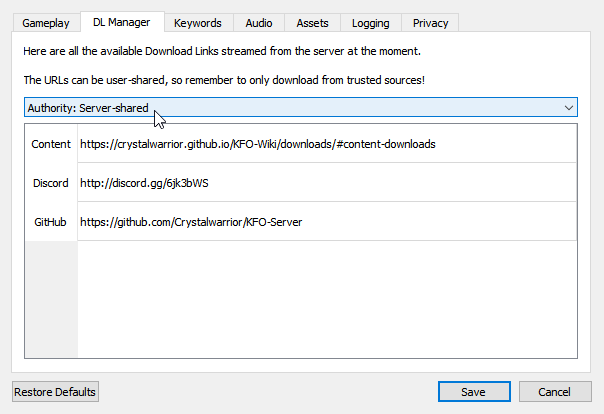
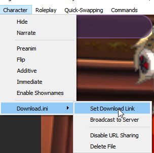
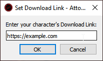

# Guide to Character Download Links

On KFO, you are able to set and obtain download links for custom characters!

There are two sections to this guide:

1. [Finding Download Links](#finding-download-links)
2. [Setting Download Links](#setting-download-links)

## Finding Download Links

First, you should know where to find the links that were set by other users/the server!

### Method 1: Finding links in KFO-Client DL Manager

1. Click Main -> DL Manager (Ctrl+G) or press Settings -> DL Manager tab

    

2. Set the "Authority" dropdown to either User-Shared, or Server-Shared

    

3. **Double-Click** any link in the list to open it in your browser!

### Method 2. Using OOC commands

1. Run `/get_link` command to get all the URLs in your current area
2. Run `/get_links` command to get all the URLs in the whole hub (must be able to run `/getareas` for this command)
3. Click on the URLs that were posted in your OOC for anyone you're missing content for!

## Setting Download Links

Next, we'll teach you how to actually set these content URL links!

### Method 1: Using Download.ini file

You don't necessarily have to have the client open for this one, but it allows you to automatically make the `Download.ini` in your current character folder (that file simply contains the download link inside of it)

1. Click Character -> Download.ini -> Set Download Link

    

2. In the new pop-up, paste in your link (note that it must begin with http or it won't work)

    

3. The link will be broadcast to everyone using an OOC message, and anyone will also be able to follow the [Finding Download Links](#finding-download-links) step to see it again!

(If you want to reset the Download Link you can press "Delete File". However, you still need to run an ooc command `/set_url` by itself to clear the link due to a client bug not transmitting the URL being cleared.)

### Method 2: Using OOC Commands

You don't have to create a `Download.ini` file locally to set a character link.

1. In OOC, run the command `/set_url https://example.com` where you swap out the link with your character's download link
2. The link will be broadcast in OOC, and also be available by all the normal methods following the [Finding Download Links](#finding-download-links) step!

## Words of Caution

User links are not vetted in any way! Please exercise caution downloading files off the internet from people you don't know.
